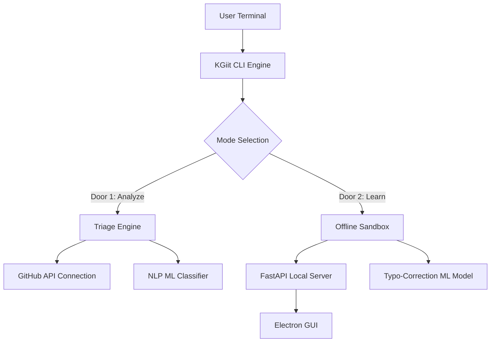

# KGiit System Architecture

KGiit is a dual-engine architecture that cleanly separates its two core modes (Analyze vs. Learn) while routing everything through a central, dynamic CLI.

## System Topology

## Core Components

### 1. `kgiit/cli.py` (The Front Door)
Acts as the central router and presentation layer. It utilizes the `Rich` Python library to construct the full-width, responsive, cyberpunk-themed ANSI interfaces.

### 2. The Analyze Engine (`kgiit/analyze/`)
An internet-connected client that fetches live repository issues using `GITHUB_TOKEN`. It pipes these issues through a trained Natural Language Processing (NLP) classifier to determine their severity, type, and required labels.

### 3. The Learn Engine (`kgiit/learn/`)
A completely isolated, offline environment.
- **FastAPI Backend**: Hosts a local API to track Git state changes in a temporary local repository.
- **Electron GUI**: Renders visual representations of branches, commits, and diffs so students can see real-time consequences of their Git commands.
- **Typo-Correction ML**: Embedded local logic that predicts the student's intended Git command if an error is raised.

## Data Persistence & Caching
KGiit relies heavily on memory-caching and state hydration rather than heavy file-I/O to keep the application ultra-fast. No heavy databases are required.
