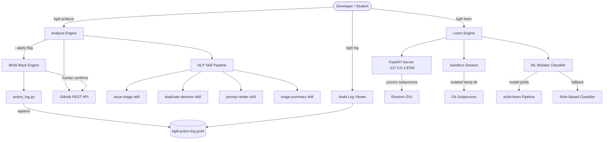
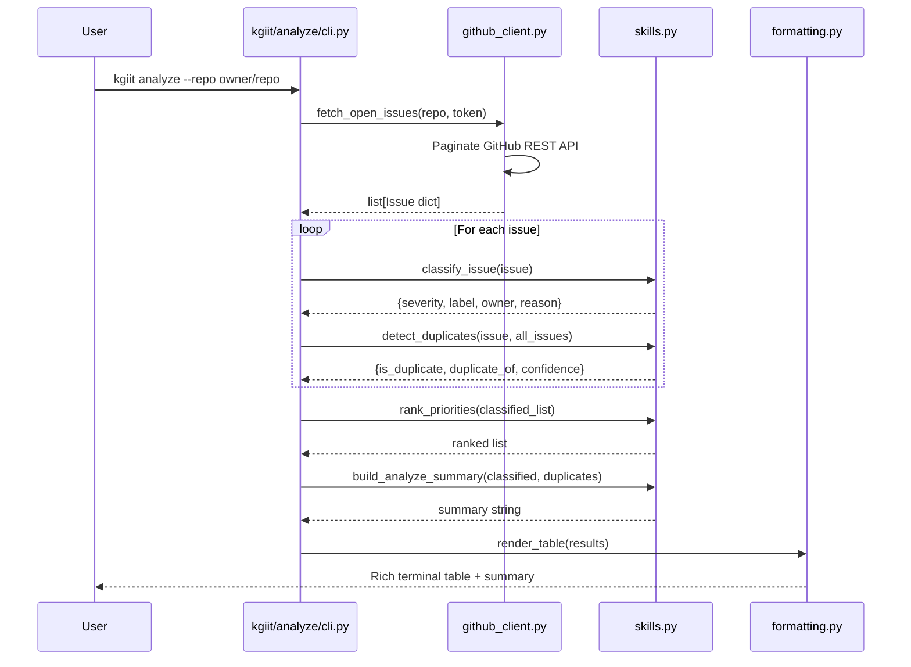
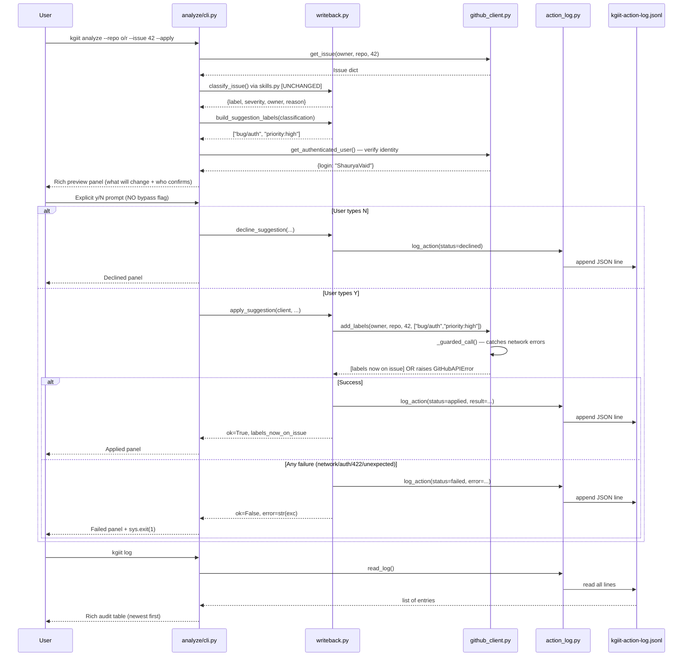
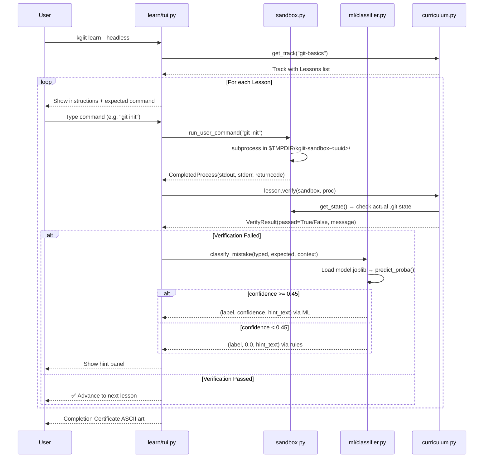
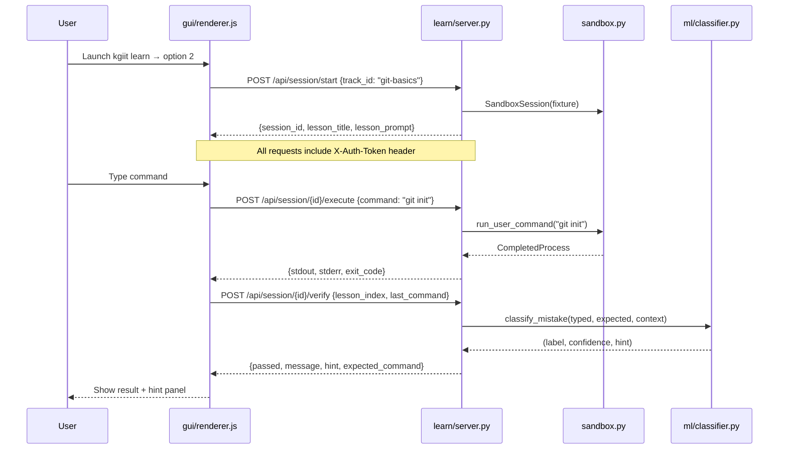

# KGiit System Architecture

**Version:** 1.2.0  
**Last Updated:** August 9, 2026

KGiit is a dual-engine, local-first developer tool with a clean separation between
its two operating modes. All processing happens on the user's machine — no cloud
backend, no LLM, no telemetry.

---

## 1. System Topology



---

## 2. Data Flow: Analyze Mode



---

## 3. Data Flow: Confirmed Write-Back (Round 2 — HowToAlgo ADLC)

This flow is the implementation of the HowToAlgo **Agent-Driven Lifecycle (ADLC)** pattern:
**AI suggests → Human decides → System acts → Every outcome is logged.**
The human is never bypassed; there is no `--yes` flag.



### Safeguards baked into this flow

| Guard | Where enforced | What happens if violated |
|-------|---------------|-------------------------|
| No `--yes` bypass | `analyze/cli.py` | Flag does not exist |
| Single-issue scope | `analyze/cli.py` | `--apply + --all-open` → `sys.exit(1)` before any network call |
| Token required for writes | `github_client.py:add_labels()` | `GitHubAuthError` before any network call |
| Network guard | `github_client.py:_guarded_call()` | `RequestException` → `GitHubAPIError` → logged as `failed` |
| Verified identity | `writeback.py:resolve_identity()` | `GET /user` → `github:login`, falls back to OS user |
| Additive writes only | `github_client.py:add_labels()` | POST `/labels` (append), never PATCH (overwrite) |
| Every outcome logged | `action_log.py:log_action()` | Even declines and failures have a durable local record |

---

## 4. Data Flow: Learn Mode (TUI Path)



---

## 5. Data Flow: Learn Mode (GUI Path)



---

## 6. Stack & Dependencies

### Core Python Package (`kgiit/`)

| Library | Version | Purpose |
|---------|---------|---------|
| `click` | ≥ 8.0 | CLI command routing |
| `rich` | ≥ 13.0 | Terminal UI rendering (tables, panels, colors) |
| `textual` | ≥ 0.40 | Full-screen TUI framework |
| `fastapi` | ≥ 0.100 | Local REST API server |
| `uvicorn` | ≥ 0.23 | ASGI server for FastAPI |
| `scikit-learn` | ≥ 1.3 | ML pipeline (training + inference) |
| `joblib` | ≥ 1.3 | Model serialization |
| `pandas` | ≥ 1.5 | Feature DataFrame construction for inference |
| `numpy` | ≥ 1.21 | Numerical operations |
| `requests` | ≥ 2.28 | GitHub API HTTP client |
| `python-dotenv` | ≥ 1.0 | `.env` file loading for `GITHUB_TOKEN` |

### Electron GUI (`gui/`)

| Technology | Purpose |
|------------|---------|
| Electron | Desktop app shell + native OS dialogs |
| Vanilla JS | Renderer logic (no framework) |
| CSS custom properties | Cyberpunk-themed design tokens |
| `contextBridge` | IPC security boundary in preload.js |

### Development Dependencies

| Library | Purpose |
|---------|---------|
| `pytest` | Test runner |
| `pytest-cov` | Coverage reporting |
| `httpx` | FastAPI test client (async-compatible) |
| `flake8` | Linting (enforced in CI) |

---

## 7. Module Structure

```
kgiit/
├── __init__.py          # version string: __version__ = "1.2.0"
├── cli.py               # Root Click group + interactive TUI menu (4 options)
├── analyze/
│   ├── __init__.py      # re-exports all public API incl. new write-back symbols
│   ├── cli.py           # `kgiit analyze` subcommand + --apply/--dual-approval/--log-file
│   ├── github_client.py # GitHub REST API wrapper + add_labels() + get_authenticated_user()
│   │                    #   + _guarded_call() network guard + GitHubValidationError
│   ├── skills.py        # classify_issue(), detect_duplicates(), rank_priorities()
│   │                    #   [UNTOUCHED in Round 2 — proof of clean architecture]
│   ├── formatting.py    # Rich renderer + print_writeback_preview/result/action_log_table
│   ├── report.py        # Markdown report generator
│   ├── action_log.py    # [NEW] Append-only JSONL audit trail (pure file I/O)
│   ├── writeback.py     # [NEW] Confirmed write-back orchestration (zero UI code)
│   └── log_cli.py       # [NEW] `kgiit log` command — reads audit trail offline
└── learn/
    ├── __init__.py
    ├── cli.py           # `kgiit learn` subcommand + demo mode
    ├── curriculum.py    # Track + Lesson dataclasses + all lesson definitions
    ├── sandbox.py       # SandboxSession: isolated git repo in temp dir
    ├── tui.py           # Textual TUI: lesson UI, hint panel, progress, certificates
    ├── server.py        # FastAPI bridge: /api/tracks, /api/session/*, /api/git/log
    └── ml/
        ├── __init__.py
        ├── classifier.py   # MistakeClassifier: lazy load + confidence threshold + fallback
        ├── data_gen.py     # Synthetic training data generator
        ├── train.py        # scikit-learn pipeline training script
        ├── training_data.csv  # 247KB synthetic training corpus
        └── model.joblib    # 12.5MB pre-trained binary artifact
```

---

## 8. Security Model

### CSRF Protection (GUI Bridge)

The FastAPI server generates a random `KGIIT_AUTH_TOKEN` UUID at startup, injected
into the Electron process's environment. Every request from the Electron renderer must
include `X-Auth-Token: <token>` in the header.

Token verification uses `hmac.compare_digest()` — a constant-time comparison that
is immune to timing attacks (unlike the `==` operator).

```python
def verify_token(x_auth_token: str = Header(None)):
    if EXPECTED_TOKEN and not hmac.compare_digest(x_auth_token, EXPECTED_TOKEN):
        raise HTTPException(status_code=403, detail="Invalid or missing X-Auth-Token")
```

### Localhost Binding

The uvicorn server binds exclusively to `127.0.0.1:8765`. It never listens on
`0.0.0.0`, ensuring it cannot receive requests from the network.

### Path Traversal Prevention (`/api/git/log`)

The git log endpoint canonicalizes the requested path using `os.path.realpath()`
before any filesystem access, resolving symlinks and `..` sequences. It then validates
that the resolved path contains a `.git` directory before spawning any subprocess.

```python
canonical_path = os.path.realpath(repo_path)
git_dir = os.path.join(canonical_path, ".git")
if not os.path.exists(git_dir):
    raise HTTPException(status_code=400, detail="Not a valid git repository")
```

### Sandbox Isolation

Every `SandboxSession` uses:
- A unique temp directory: `$TMPDIR/kgiit-sandbox-<uuid4>/`
- `GIT_CONFIG_GLOBAL=/tmp/kgiit-sandbox-<uuid>/gitconfig` — throwaway config
- `GIT_AUTHOR_EMAIL`, `GIT_COMMITTER_NAME` — set to sandbox-specific values
- `SandboxSession.purge()` — called on exit to clean up all temp files

The sandbox can never modify the user's real git configuration or filesystem.

---

## 9. ML Pipeline

### Training Data
- Generated by `kgiit/learn/ml/data_gen.py`
- 247KB CSV with columns: `command`, `edit_distance`, `flag_delta`, `arg_delta`,
  `context_has_staged`, `context_has_unstaged`, `context_is_init`, `label`
- Labels: TYPO, WRONG_FLAG, MISSING_ARG, EXTRA_ARG, WRONG_SUBCOMMAND,
  WRONG_CONTEXT_STATE, WRONG_ORDER, SYNTAX_ERROR, DEPRECATED_USAGE,
  PARTIALLY_CORRECT, CORRECT, UNKNOWN

### Pipeline Architecture
```
Input: (typed_command, expected_command, context_dict)
           ↓
   _build_feature_row() → 7 numerical features
           ↓
   pandas.DataFrame([row])
           ↓
   sklearn.Pipeline:
     ├── StandardScaler (numerical features)
     └── RandomForestClassifier
           ↓
   predict_proba() → 12-class probability array
           ↓
   argmax → (label, confidence)
           ↓
   if confidence < 0.45 → _rule_based_classify()
           ↓
   HINT_TEMPLATES[label].format(typed=..., expected=...)
           ↓
   Return: (label, confidence, hint_text)
```

### Performance
- Accuracy: 87.6% on held-out test set
- Inference latency: 5.9ms average (sub-50ms target)
- Model size: 12.5MB (committed to repo for zero-dependency operation)

---

## 10. CI/CD Pipeline

Two workflows run on every push to `main` and every pull request:

### `ci.yml` — Full Matrix Test Suite
- **6 combinations:** Ubuntu × {3.9, 3.11}, macOS × {3.9, 3.11}, Windows × {3.9, 3.11}
- **Steps:** install → configure git → run tests → run sandbox tests → skill contract tests → ML tests → CLI smoke tests
- **Lint job:** flake8 on `kgiit/` with max-line-length=110

### `python-app.yml` — Coverage Report
- Ubuntu, Python 3.11
- `pytest --cov=kgiit --cov-report=term-missing tests/`
- Badge linked from README

### CI Badge
[](https://github.com/ShauryaVaid/kgiit/actions/workflows/python-app.yml)

---

## 11. Ports & Protocols

| Component | Protocol | Address | Port | Auth |
|-----------|----------|---------|------|------|
| FastAPI (uvicorn) | HTTP | 127.0.0.1 | 8765 (dynamic) | X-Auth-Token header |
| GitHub REST API | HTTPS | api.github.com | 443 | GITHUB_TOKEN (optional) |
| Electron → FastAPI | HTTP (local only) | 127.0.0.1 | same as uvicorn | X-Auth-Token header |

---

## 12. Data Persistence

KGiit deliberately avoids databases. State is held in:

| Data | Storage | Lifetime |
|------|---------|---------|
| Sandbox git state | Temp directory | Session only |
| FastAPI session store | In-memory dict | Process lifetime |
| ML model | `model.joblib` (file) | Permanent (committed) |
| GitHub API response | In-memory | Single run |
| Auth token | Environment variable | Process lifetime |
| **Write-back audit log** | **`kgiit-action-log.jsonl` (JSONL file)** | **Permanent — append-only, survives process restarts** |

This design keeps the tool lightweight (< 5MB heap excluding model) and stateless
across runs — no database migrations, no cleanup required.

The audit log is the **one deliberate exception** to the stateless design: it is
intentionally durable, append-only, and human-readable (`cat kgiit-action-log.jsonl`),
because the whole point of the confirmed write-back feature is that every human
approval is provably on record — including declined ones.
