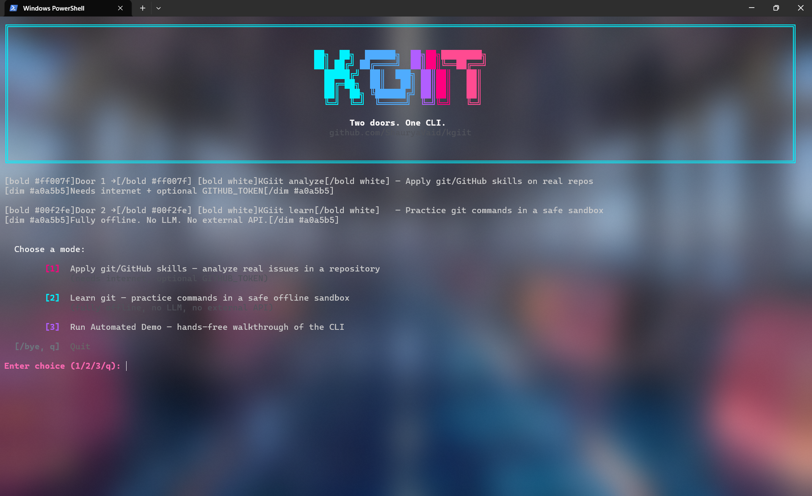
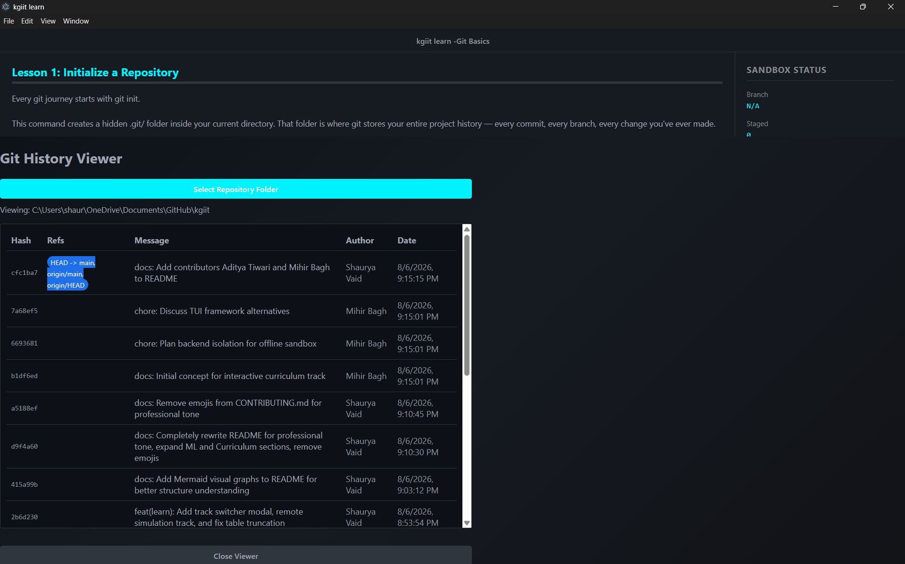
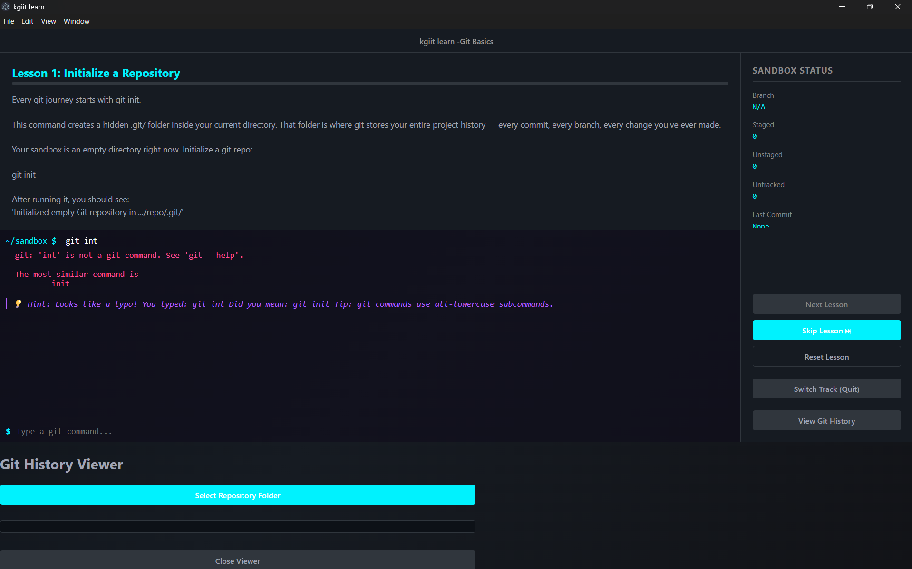
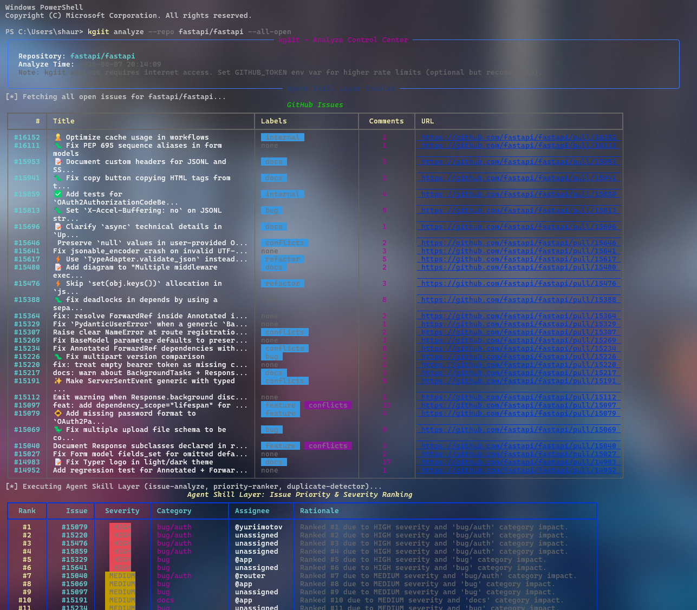
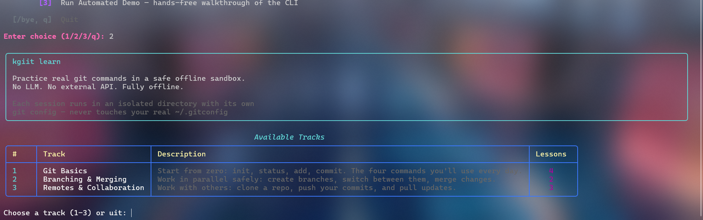
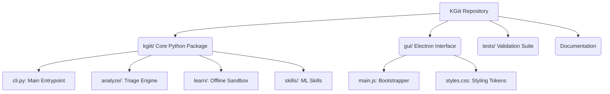
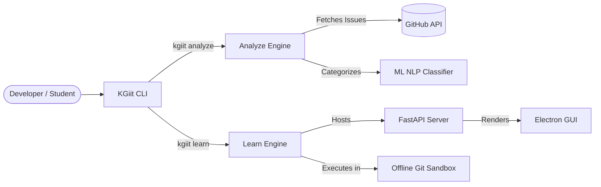
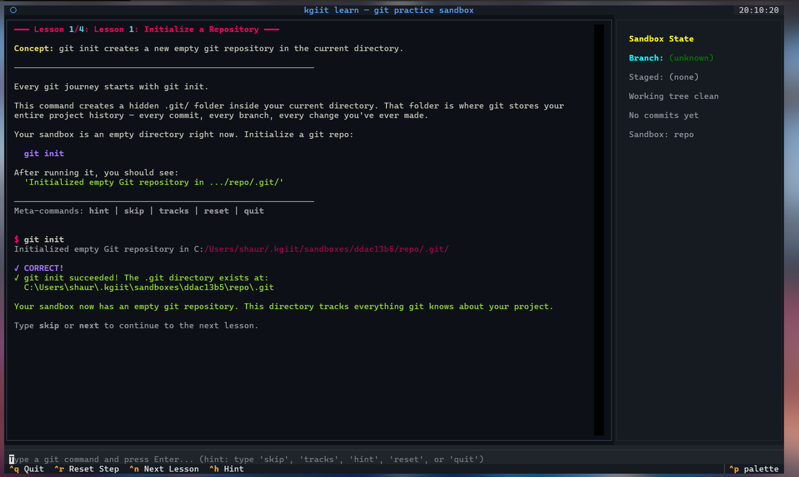

<div align="center">
  
# KGiit (v1.2.0)

[](https://www.python.org/downloads/release/python-390/)
[](https://opensource.org/licenses/MIT)
[](https://github.com/ShauryaVaid/kgiit/actions/workflows/python-app.yml)

<br/>

```text
 ██╗  ██╗ ██████╗ ██╗██╗████████╗
 ██║ ██╔╝██╔════╝ ██║██║╚══██╔══╝
 █████╔╝ ██║  ███╗██║██║   ██║   
 ██╔═██╗ ██║   ██║██║██║   ██║   
 ██║  ██╗╚██████╔╝██║██║   ██║   
 ╚═╝  ╚═╝ ╚═════╝ ╚═╝╚═╝   ╚═╝   
```
**Two Doors. One CLI.**

<br/>


</div>

---

## Overview

### Why This Project Exists
Version control is often an intimidating hurdle for new developers. **KGiit was built specifically to lower the barrier to entry for beginners.** As major open-source initiatives like **Google Summer of Code (GSoC) 2027** approach, having a strong, practical grasp of Git is critical for students wanting to contribute to real-world projects. KGiit provides a safe, interactive, and AI-assisted sandbox where students can practice branching, merging, and collaboration without fear, ensuring they are fully prepared for open-source development when the time comes.

### Hackathon Alignment
**Track B: Developer Productivity Tools**  
This project is submitted under Track B, addressing the directive to "build a tool that helps software teams themselves." 

KGiit aligns directly with the track's primary examples through its dual-engine architecture:
- **Analyze Engine:** Implements the required *"bug-triage assistant that reads incoming issues and suggests labels, severity, and likely owners."*
- **Learn Engine:** Functions as an educational productivity tool, enabling students to safely learn version control fundamentals before contributing to production repositories.

### What is KGiit?
**KGiit** is an advanced, dual-engine Command Line Interface designed for modern software engineering education and repository management. It serves as both a completely offline educational sandbox for mastering Git workflows and an active, network-connected diagnostic engine for analyzing live GitHub repositories.

Built with a high-performance Python backend and an integrated dynamic Terminal User Interface (TUI), KGiit seamlessly bridges the gap between learning theoretical version control concepts and executing them in real-world scenarios.

- **Analyze Mode (`kgiit analyze`)**: An internet-connected triage engine that interfaces directly with the GitHub API. It pulls live repository issues and utilizes Natural Language Processing (NLP) to categorize, prioritize, and diagnose real-world software defects.
- **Learn Mode (`kgiit learn`)**: A 100% offline, isolated sandbox environment. It allows students to practice destructive Git commands safely without the risk of affecting production environments or modifying the host operating system's global Git configuration.

> [!WARNING]
> **Deployment & Security Model:** KGiit is strictly a **local, single-user developer tool**. 
> The integrated FastAPI server binds exclusively to `127.0.0.1`. It is highly scalable in terms of user distribution (millions of users can run it locally), but it is NOT a hosted multi-tenant cloud service. To protect against CSRF attacks from malicious browser tabs, the server enforces a randomized, per-session `X-Auth-Token`.

---

## Universal Git History Viewer

Added in **v1.1.0**, KGiit features a rich, interactive Git History Viewer integrated directly into the Electron GUI.

<div align="center">
  
</div>

* **Universal Folder Picker:** You are not restricted to the sandbox. Using native OS dialogs, you can select any local repository on your system to view its history.
* **Structured & Scalable:** The backend parses raw git output into structured JSON, capable of rendering branching graphs and traversing histories spanning thousands of commits.
* **Hardened Security:** The local endpoint enforces strict path canonicalization, `.git` presence validation, and a 10-second subprocess timeout. It utilizes data-capping (`--max-count=500`) to guarantee extreme performance (sub-100ms response times and <5MB memory footprint) even on massive repositories like the Linux Kernel.

---

## Machine Learning Integration

KGiit differentiates itself from standard terminal utilities through its integration of custom-trained, locally executing Machine Learning models.

### Typo Correction & Command Classification
In the offline learning sandbox, students often make syntactical errors when attempting complex Git commands. KGiit intercepts these failures and passes the erroneous input through a localized classification model. Powered by a scikit-learn Random Forest pipeline, the algorithm uses string distance heuristics and semantic feature extraction to accurately predict the user's intended Git command, providing immediate, context-aware pedagogical hints rather than standard terminal error codes.

<div align="center">
  
</div>

### NLP Issue Triage Engine
When executing `kgiit analyze`, the system retrieves raw issue data from GitHub. The embedded NLP classifier analyzes the unstructured text of issue titles and bodies, extracting semantic meaning to automatically assign severity rankings (HIGH, MEDIUM, LOW) and categorical labels (bug, docs, enhancement). This drastically reduces the manual overhead required for repository maintainers to triage incoming tickets.

<div align="center">
  
</div>

---

## Confirmed Write-Back (Round 2 — HowToAlgo ADLC)

Analyze Mode was read-only through Round 1 — it suggested labels and
severity but never touched a real issue. **It can now act, but only with a
human explicitly in the loop for every single write.**

This is the core of the HowToAlgo **Agent-Driven Lifecycle (ADLC)** pattern:
AI suggests → Human decides → System acts → Every outcome is auditable.

```bash
# Analyze a single issue and offer to apply the AI suggestion
kgiit analyze --repo owner/name --issue 42 --apply
```

This shows the classification as before, then previews exactly what would
change — current labels, proposed labels, and who is confirming (resolved
from your `GITHUB_TOKEN`'s real GitHub identity, not a typed-in name) —
and waits for an explicit `y/N`. Nothing is sent to GitHub until you
confirm; declining is fully supported and is itself logged. **There is no
flag to skip the prompt.**

Every attempt — applied, declined, or failed — is written to a local,
append-only audit log:

```bash
kgiit log
# or inspect directly: cat kgiit-action-log.jsonl
```

**To verify this yourself (judge walkthrough):**
1. Run the command above → answer `n` (decline)
2. Run it again → answer `y` (confirm)
3. Check the real issue on GitHub for the new labels
4. Run `kgiit log` → see both the decline and the apply, each with a
   timestamp and a verified confirmer identity

**Design choices worth noting:**
- **Scoped to one issue at a time.** `--apply` is rejected with `--all-open`
  on purpose — the highest-risk action stays single-issue.
- **Additive, not destructive.** Labels are added via GitHub's "add labels"
  endpoint, so existing labels on the issue are never overwritten.
- **Graceful failure.** A bad token, missing permissions, or dead network
  produces a clear, logged failure message — never a raw traceback.
- **Optional `--dual-approval`** requires two different confirmations before
  a write is sent, for teams that want a stricter gate than the default.
- **Verified identity.** "Who confirmed" in the log is your actual GitHub
  login from the token (`GET /user`), not a typed-in name — backed by
  GitHub's own auth, not an honor system.

Available from both the CLI (`kgiit analyze --apply`) and the **interactive
TUI menu** (option 3 for write-back, option 4 for viewing the audit log).

See [ARCHITECTURE.md § 3](ARCHITECTURE.md) for the full data-flow diagram
and the reasoning behind the clean module split between `skills.py`
(pure classification), `writeback.py` (confirm/apply orchestration, zero
UI code), and `github_client.py` (the only thing that talks to GitHub).

---

## Interactive Curriculum

The KGiit Learn Engine includes a comprehensive, interactive curriculum designed to take users from absolute beginners to collaborative engineers. The curriculum is divided into three primary tracks:

<div align="center">
  
</div>

### 1. Git Basics
Focuses on the foundational operations required for local version control.
- **Lesson 1: Initialize a Repository** (`git init`)
- **Lesson 2: Check Repository Status** (`git status`)
- **Lesson 3: Stage a File** (`git add`)
- **Lesson 4: Make a Commit** (`git commit`)

### 2. Branching & Merging
Introduces parallel development concepts and non-linear history management.
- **Lesson 1: Create & Switch Branches** (`git branch`, `git switch`)
- **Lesson 2: Merge Branches & Resolve Conflicts** (`git merge`) - *Includes a pre-seeded, interactive merge conflict resolution scenario.*

### 3. Remotes & Collaboration
Simulates a secure, offline network environment to teach collaborative workflows without requiring an internet connection.
- **Lesson 1: Clone a Repository** (`git clone`)
- **Lesson 2: Push Changes** (`git push`)
- **Lesson 3: Pull Changes** (`git pull`)

---

## System Architecture

### Project Structure



### Execution Workflow



---

## Setup and Installation

### Prerequisites
- Python 3.10 or higher
- Git installed and available in the system PATH
- Node.js (Required if you intend to use the KGiit Electron GUI)

### Installation Instructions

1. **Clone the repository:**
   ```bash
   git clone https://github.com/ShauryaVaid/kgiit.git
   cd kgiit
   ```

2. **Install the Python package:**
   It is highly recommended to install the package in editable mode so that the `kgiit` binary is automatically linked to your system PATH.
   ```bash
   pip install -e .
   ```

3. **Install GUI Dependencies (Optional but recommended):**
   If you plan to use the graphical interface, you must install the Electron dependencies using Node.js.
   
   > [!NOTE]
   > **Getting an error like `'npm' is not recognized`?**
   > This means Node.js is not installed on your system! You must download and install the **LTS (Long Term Support)** version from [nodejs.org](https://nodejs.org/). After installing, you **must close and restart your terminal** before running the command below.

   ```bash
   cd gui
   npm install
   cd ..
   ```

4. **Verify Installation:**
   ```bash
   kgiit --help
   ```

### Usage

To launch the primary KGiit interface, execute:
```bash
kgiit
```

From the main menu, you can select the desired mode using your keyboard arrows. 
- For the **Analyze Mode**, exporting the `GITHUB_TOKEN` environment variable is recommended to bypass standard API rate limits.
- The **Learn Mode** operates entirely offline and requires no additional configuration.

To exit the application interface at any time, type `/bye` or `q`.

If you prefer learning inside the terminal without the GUI, you can run the headless TUI mode:
```bash
kgiit learn --headless
```

<div align="center">
  
</div>

---

## Documentation Links

For further technical details and contribution guidelines, please refer to the specific documentation files included in this repository:

- [System Architecture Guide](ARCHITECTURE.md) - A deep dive into the system design, ML integration, and CLI-GUI communication protocols.
- [Contributing Guidelines](CONTRIBUTING.md) - Instructions for setting up a development environment, running the Pytest validation suite, and submitting pull requests.

---

<div align="center">
  <b>Authored by Shaurya Vaid</b> <br/>
  <i>Building robust tooling for modern engineering education.</i>
  <br/><br/>
  <b>Contributors:</b> Aditya Tiwari and Mihir Bagh
</div>
